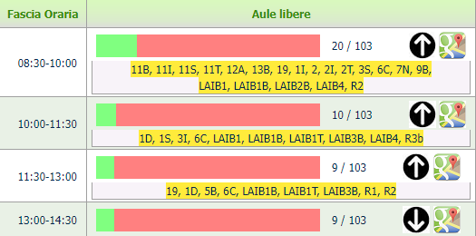
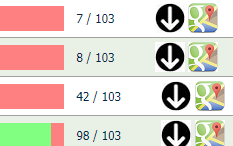

###### *Tool* *Progetto personale*
# Aule Libere Polito
Progetto indipendente con l'obiettivo di migliorare notevolmente il servizio "aule libere" del Politecnico di Torino, attraverso un efficace redesign della UX/UI.  
[Vai progetto 🔗](https://domescala.github.io/aule_libere_polito)

## Il problema
Il sito fornito dal [portale 🔗](https://www.swas.polito.it/dotnet/orari_lezione_pub/mobile/ricerca_aule_libere.aspx) non è sempre semplicissimo e comodo da consultare:
### ❌ Disposizione delle aule
> Ogni fascia oraria dispone di un blocco di testo semplice con le aule in ordine alfabetico. L'utente è obbligato a cercare faticosamente nell'elenco di ogni blocco se un'aula, ad esempio, rimane libera per due fasce consecutive.

### ❌ Elementi inutili e fuorvianti
> Senza alcun motivo le liste delle aule sono inizialmente nascoste ed è necessario premere il pulsante "⬇" per rivelarle. Da subito invece si mostra un numero che rappresenta inutilmente la quantità di aule libere sul totale.   

### ❌ Eccessiva latenza
> La selezione di un giorno o di una sede, il sito può richiedere anche 10 secondi prima di mostrare i risultati. La latenza deriva dal fatto che il server genera da capo l'intero sito ogni volta, con la lista delle nuove aule.
## Redesign
Nella nuova pagina le aule sono disposte in una lista verticale. Ognuna è suddivisa negli otto slot orari che indicano la disponibilità. A colpo d'occhio l'utente vede quali aule sono disponibili nella fascia corrente e in quelle successive. Un sistema di filtri permette di ordinare in base alla disponibilità, alla zona, al piano, alla capienza e alla superficie.

## Nuove feature
- [🏃🏻‍♂️ Velocità di caricamento e consultazione](#velocità-di-caricamento-e-consultazione-🏃🏻‍♂️) 
- [📊 Filtri per ordinare le aule in base alla disponibilità, alla zona, al piano, alla capienza e alla superficie](#filtri-per-ordinare-le-aule-📊)   
- 📄 Pagina di recap sulle informazioni generali dell'aula selezionata 
- 🎨 La fascia oraria corrente è evidenziata
- [🔎 Ricerca aule](#ricerca-aule-🔎)
- 📆 Avvio sul primo giorno consultabile 
- ⚡&#xFE0F; Avviso in caso di prese elettriche assenti 
- [⭐ Aule preferite](#aule-preferite-⭐)
- 🏫 Memorizzazione dell'ultima sede selezionata 
## Funzionamento
### Velocità di caricamento e consultazione 🏃🏻‍♂️
La soluzione migliore al problema della latenza è quella di conservare tutti i dati relativi alle aule già nel client. Per fare ciò è stato necessario sviluppare in python uno script che raccogliesse uno ad uno tutte le liste delle aule disponibili di ogni giorno per ogni sede. Questo script viene eseguito manualmente dal mio PC circa una volta a settimana, e i dati vengono aggiornati sul repository di Github  nel file [classrooms_data.js 🔗](https://domescala.github.io/aule_libere_polito/js/classrooms_data.js).  
Poiché la disponibilità di ogni aula è suddivisa in **otto fasce** orarie al giorno, ad essa è stato associato un numero binario di **otto cifre** in cui **1** e **0** rappresentano lo stato di disponibilità.
> `11111111` -> Aula sempre libera  
> `10001111` -> Aula libera per la prima e le ultime 4 fasce  
> `00000000` -> Aula sempre occupata  

Questo numero è convertito in uno esadecimale a due cifre per salvare spazio
> `11111111` -> `FF`  
> `10001111` -> `AF`  
> `00000000` -> `00`

Ed infine, poiché le aule rimangono sempre le stesse, nel dizionario non verrà salvato il nome dell'aula:
> ❌ `giorno1: aula1 : "FF", aula2 : "AF" ` ❌

I nomi delle aule sono conservate in un'altra variabile in ordine alfabetico e per ogni giorno si uniranno insieme tutte le disponibilità:
> `"giorno1" : "FFAF00...."` 👌🏻

E automaticamente il codice prenderà le cifre a due a due ottenendo in codice binario e le disponibilità. Lo script che parsifica il dizionario delle aule si può consultare qui: [parse_classrooms_data.js 🔗](https://domescala.github.io/aule_libere_polito/js/parse_classrooms_data.js)

### Filtri per ordinare le aule 📊
Le informazioni riguardo il piano, la capienza, la superficie, la zona e la eventuale presenza di prese elettriche nelle aule sono disponibili all'interno del [portale 🔗]([https://](https://www.polito.it/ateneo/chi-siamo/sedi-e-mappe?bl_id=TO_CEN03&fl_id=XPTE&lang=it&rm_id=D001)). È stato necessario scaricarli (una tantum) attraverso uno script di scraping in python e caricarli nel repository ([classrooms_info.js 🔗](https://domescala.github.io/aule_libere_polito/js/classrooms_info.js)). 
 
Ad ogni riga (aula) sono stati inseriti tutti gli attributi (capienza, superficie, piano...) con i relativi valori (300🪑, 250m2, Primo piano...).  

A questo punto per azionare un filtro basterebbe prendere tutti tutte le aule, ordinarle in una lista in base ad un valore (es: capienza) ed assegnare attraverso l'attributo *CSS Order* un numero progressivo.  
Ma per motivi di prestazioni è stata creata una variabile con i valori già ordinati (tutte i valori delle capienze, superfici, piani...). In questo modo per ogni attributo (es: capienza) si cerca il suo valore all'interno della lista ordinata di tutte le capienze. L'attributo CSS *Order* assumerà quindi l'indice di quella lista.
Infine, solo per aule contrassegnate come preferite si sottrarrà 200 dall'attributo CSS *Order*, affinché siano visualizzate per prime e conservino tra loro l'ordinamento.
Il filtro sulle fasce libere si comporta in modo diverso durante il giorno corrente perché è influenzato dal tempo, non sono considerate infatti le fasce orarie già passate.

L'attributo delle attuali fasce libere è un numero a 8 cifre. Ogni cifra mostra la somma delle fasce libere totali in quella fascia oraria:
> `1001001` -> `3222111`  
> Ci sono tre fasce libere in totale. Ma solo all'inizio sono tre, poi ne rimangono due ed infine una

### Ricerca aule 🔎 
È stato creato un semplice tag di input, in cui i suggerimenti sono la lista dei nomi delle aule. In tal modo inserendo anche una parte del nome appariranno tutte le aule con quella porzione di testo. Nella lista delle opzioni il nome di ogni aula finisce con il carattere speciale invisibile `\u2063`, in modo che il listener (che ascolta ogni input) si accorga se è stato premuto una delle opzioni.  
Per praticità il tasto di ricerca appare quando l'utente esegue uno scroll, come a dire: "*stai cercando un'aula premi qui ;)*"
### Aule preferite ⭐
Nel box di informazioni di ogni aula è presente un toggle per salvare l'aula come Preferita. Le aule preferite sono visualizzate sempre per prime nella lista (Come? Al valore *CSS order* si sottrae 200. Vedi [*CSS Order*](#rimando-css-order)). Attraverso il localStorage la lista delle aule preferite è salvata in locale.

