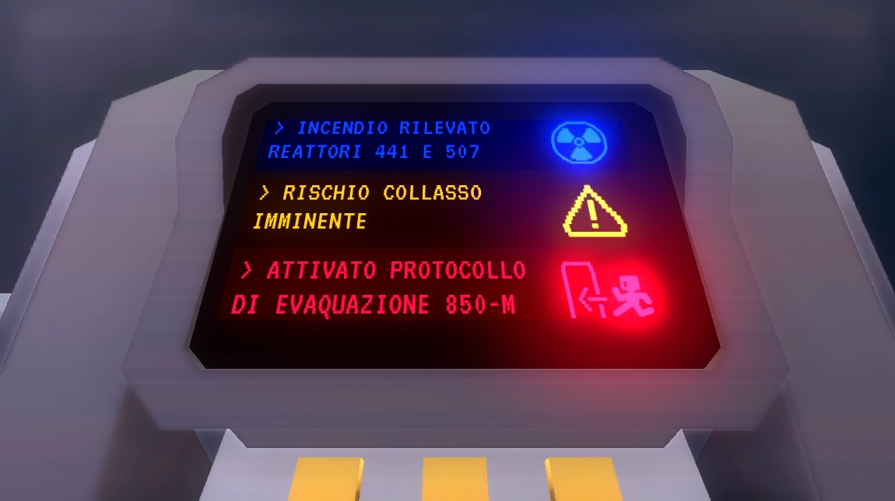

<compileMeta 
  description="Puzzle game sci-fi in prima persona ispirato ad un livello di Superliminal"
  image="cover.gif" 
/>
<favicon-emoji>👩🏻‍🚀</favicon-emoji>

<link rel="stylesheet" href="../style.css">

###### _Puzzle game_ _Godot engine_

# Deckfall

<video id="trailer" class="prevent-cover" autoplay muted loop><source src="../assets/reel.mp4" type="video/mp4"></video>

<em>Trailer di Deckfall
 
Musica: "Revolution" di [Alex-Productions](https://soundcloud.com/alexproductionsmusic) — CC BY 3.0</em>

## Descrizione 📢

Deckfall è un puzzle game in prima persona, sviluppato in **Godot Engine** e ispirato ad un livello di _Superliminal_.
Il giocatore si trova su una astronave sul punto di collassare e dovrà percorrere un corridoio (quasi) infinito in cerca di una via d'uscita.

Il gioco è disponibile sia ITCHIO (come build) che su github (progetto completo e build)

## Come giocare

Per i sistemi windows è sufficiente scaricare e avviare il file eseguibile `deckfall.exe`. Per gli altri sistemi si può avviare il gioco all'interno dell'editor di Godot 4.4.1!

### 💻 Windows 

1. Scarica il file esegubile `deckfall.exe` dal repository: [link404](/licence)
2. Avvialo e gioca

### 💻 Windows / macOs / linux

1. Scarica `Godot 4.4.1` dal sito ufficiale: <https://godotengine.org/download/archive/4.4.1-stable/>
2. Scarica `deckfall-v1.0.zip` dal repository: <https://github.com/domescala/deckfall-beta/archive/refs/tags/v0.1-beta.zip>
3. Avvia `Godot_v4.4.1` e **trascina** il file `deckfall-v1.0.zip` all'interno della finestra
4. Fai click su `install` e Godot spacchetterà in automatico il progetto: attendi qualche in qualche minuto
5. Avvia il gioco premendo il tasto `F5` o il pulsante ▶️ in alto a destra
6. Gioca!

### ⚙️ Impostazioni

Il gioco è disponibile in italiano e in inglese, questa impostazione si trova solo nel menù iniziale e non sarà modificabile a gioco avviato. Dal menù di pausa (premi `ESC`) è possibile aggiustare la sensibilità del mouse e modificare il livello di qualità.

## Lincenze e Crediti 🏷️

Il progetto è rilasciato con diverse licenze definite nel dettaglio all'interno del file [LICENCE404](/licence). Riassumendo le licenze si dividono in:

1. **Gioco compilato (Build)**  
   Siccome sono stati utilizzati assets di terze parti con varie licenze tra cui "ShareAlike", il gioco compilato (build) è distribuito con licenza di Attribuzione e ShareALike (CC BY-SA 4.0).
2. **Codice**  
   Gli script sono sotto Licenza MIT
3. **Asset originali**  
   Gli asset creati ad hoc per il progetto hanno la sola licenza di Attribuzione (CC BY 4.0).

Tutte le risorse sono accreditate nel file [CREDITS404](/licence)

## Modelli 3D 

Per gli elementi strutturali (muri, pavimenti, scalini, porte...) e per i dettagli (tubi, barili, monitor...) sono stati utilizzati gli asset della libreria Sci-fi "Space Station Kit" di Kenney (licenza CC0). Mentre i modelli specifici e "dinamici" come i numeri luminosi pixelati e la leva d'emergenza sono stati modellati ad hoc in Blender.

<video autoplay muted loop><source src="../assets/pixel_numbers.mp4" type="video/mp4"></video>
<video style="filter: brightness(1.5);" autoplay muted loop><source src="../assets/floorsign.mp4" type="video/mp4"></video>
<video style="filter: brightness(1.5);" autoplay muted loop><source src="../assets/lever.mp4" type="video/mp4"></video>
<em>...</em>

### Stanze 🏗️

La creazione delle stanze è stata svolta direttamente all'interno dell'engine

<em>Corridoio principale</em>

<em>Vista sul corridoio che porta verso l'uscita di sinistra</em>

<em>Ostacoli che bloccano la porta</em>

<em>stanza ad angolo con scale che danno verso il corridoio successivo</em>

<em>Ponte Zero, stanza finale</em>

## Musiche 📻

### Colonna sonora

Per il sottofondo musicale è stato scelto il brano _"A Few Jumps Away"_ di Arthur Vyncke selezionato attraverso il sito _BreakingCopyright_ (licenza CC BY-SA 3.0).  
Il sound **elettronico** e la leggera melodia al pianoforte riprende l'ambientazione sci-fi, con un ritmo ciclico tipico dei puzzle game.

### Loop e musica dinamica

Il brano è stato adattato amplificando i volumi nell'introduzione e riducendoli nel ritornello, per creare un loop omogeneo e costante.
Durante il menù di start e per tutto il primo livello, si riproducono in loop solo i primi 20 secondi, caratterizzati da un accompagnamento ritmato senza la melodia.
Entrando nel livello successivo la musica continua nella seconda parte, con la melodia al pianoforte e lo sviluppo vero e proprio del brano.

### Jingle

Durante la cutscene iniziale si puo sentire un Jingle proveniente dal monitor durante il messaggio promozionale della compagnia spaziale. I brano _"Crystals"_ di envirOmaniac2 (CC0), selezionato per il suo sound estremamente **allegro**, completamente in contrasto con la situazione **tragica e allarmante**.

▶️ Ascolta il jingle!
🔵 premi per fermare
<audio loop src="../assets/audio_jingle_394293__enviromaniac2__crystals.wav" title="Title" ></audio>

## Easter eggs e riferimenti 

### Graffiti

Sul muro di fronte alle scale la scritta _This Way_ aiuta il giocatore a capire di doversi buttare di sotto per proseguire il gioco.
Inoltre questa prima scritta incisa suggerisce che ne esistano anche altre.

Sul muro sopra la finestra da cui si vede lo spazio, è presente una frase incisa che recita _"You're looking in the wrong direction"_. È un riferimento ad un graffito Torinese scritto su un muro di fronte alla Mole Antonelliana.

<blockquote>

<i class="spoiler-alert">ATTENZIONE SPOILER! (premi per rivelare)</i>
La frase rivela la soluzione del puzzle, infatti il graffito è visibile solo dopo che il giocatore avrà sbagliato per la prima volta

</blockquote>

Sui muri delle stanze ad angolo è riportato in tempo reale il conteggio dei tentativi del giocatore, con una incisione nello stile dei tally marks.

### L'omino che corre

Il segnale luminoso che indica l’uscita, mostra un omino di corsa identico a quello usato dal nodo CharacterBody3D del Godot Engine. Lo stesso omino è ripreso anche nel logo del gioco e nel segnale _pavimento fragile_, in cui però è raffigurato mentre precipita.

<video style="scale:2;margin-top:10%;" autoplay muted loop  title="cartello pavimento fragile"><source src="../assets/floorsign.mp4" type="video/mp4"></video>

### Numeri

Durante l'introduzione, il monitor mostra alcuni messaggi di errore e di pericolo e tra questi si nascondo alcuni riferimenti numerici.

> "...REATTORI 441 E 507"  
> "...PROTOCOLLO DI EVAQUAZIONE 850-M"

- **441** rappresenta la versione dell'engine: `Godot 4.4.1`
- **507** è la Nave utilizzata dal rapper Rancore nel suo album XENOVERSO
- **850-m** si riferisce al codice della scheda video (molto datata) del PC con cui è stato realizzato il gioco, ovvero la _NVIDIA GTX 850M_.

## Funzionamento

ATTENZIONE SPOILER TOTALE! (premi per rivelare)

### Meccanismo della soluzione

Il puzzle (che si rifà ad un livello di superliminal) è strutturato in modo che una freccia indica la via di uscita corretta ma la prima porta che il giocatore _guarda_ è sempre bloccata, mentre la seconda è sempre liberaà.

Il modo più semplice per realizzarlo è posizionare da subito un ostacolo su entrambe le porte, non appena il giocatore ne guarda uno si rimuove immediatamente quello opposto.

<video style="position:absolute" class="prevent-cover" muted title="soluzione"><source src="../assets/solution.webm" type="video/webm"></video>
<video id="solution-video" class="prevent-cover" autoplay muted title="soluzione"><source src="../assets/solution.webm" type="video/webm"></video>

_Ma come si crea questo meccanismo?_

In Godot Engine esiste un Nodo chiamato `VisibleOnScreenNotifier3D` capace di emettere un segnale quando la sua area entra o esce dal _campo visivo_ della Camera.

Così facile? No, perché non si tratta di un vero _campo visivo_ che tiene conto eventuali ostacoli o muri, ma di una **regione tridimenisionale proiettata** dalla camera, anche detta _Frustum View_.  
Quindi il Nodo `VisibleOnScreenNotifier3D` si considera "visibile" quando entra nel Frustum, anche se è nascosto da un muro e non può essere visto direttamente dal giocatore.

<em>Un chiaro esempio di oggetti che sono all'interno del Frustum View, ma rimangono invisibilial giocatore a causa di un ostacolo</em>

Per risolvere questo problema basterà rilevare quando tra il giocatore ed il Nodo `VisibleOnScreenNotifier3D` si trova un ostacolo visivo.

_Ma in che modo?_

### Tentativo con un Raycast3D

La scelta più immediata è quella utilizzare un nodo `RayCast3D` che parte dallo stipite della porta e punta costantemente verso il giocatore.

Se il raycast collide direttamente con il Body del giocatore significa che non ci sono ostacoli nel mezzo e che possiamo "_fidarci_" del segnale emesso dal `VisibleOnScreenNotifier3D`.

<em style="grid-row-start: 2">Raycast bloccato dal muro</em>

<em style="grid-row-start: 2">Raycast che colpisce il giocatore</em>

**BUG**: il Raycast punta "costantemente" verso il giocatore con la funziona `look_at()`, e rileva le collisioni attraverso la funzione `get_collider()`. Questo meccanismo sembra funzionare sulla carta, ma nella pratica non è affidabile: il raycast rischia di non aggiornare la sua direzione in tempo quando il giocatore si muove molto velocemente. In fase di testing è stato provato che è possibile intravedere di sfuggita la porta senza azionare il meccanismo, rompendo di fatto la regola principale del puzzle.

### Tentativo con un Area3D

Siccome le pareti della stanza e le porte sono elementi sempre fissi, il raycast idealmente diventa "utile" solo oltrepassata la linea tra porta e l'angolo del muro.  
Si può quindi ottenere lo stesso meccanismo con un nodo `Area3D` che copre proprio questa regione. Quando il giocatore entra nella zona significa che non ci sono ostacoli tra lui e la porta e per tanto possiamo "_fidarci_" del `VisibleOnScreenNotifier3D`.

### Il Corridoio Infinito

Quando si "_cade_" dalle scale si atterra in un corridoio identico al quello di partenza, simulando una sorta di loop infinito.
Tra i gradini e il pavimento c'è un Nodo `Area3D` che rileva quando il giocatore sta cadendo, emette un segnale e il gioco reimposta la posizione al corridoio iniziale, nello stesso punto "relativo".
Si tratta infatti di due scene identiche duplicate, con un `Marker3D` posto di fronte alle scale. Durante la caduta si prende la posizione del giocatore rispetto questo marker e si calcola quale sarebbe la posizione partendo invece al marker del corridoio principale.

<em>Scale che danno sul corridoio successivo</em>

<em>Vista dall'alto della mappa di gioco</em>

<em>Vista prospettica della mappa di gioco</em>

### SOLE

Il sole proietta una forte luce all'interno della nave attraverso la finestra del corriodio principale. Roteando ad una velocità lenta e costante ricrea l'effetto del classico movimento di una nave in orbita.

Il sole è in realtà una combinazione di una Mesh luminosa a forma di sfera ed un Nodo SpotLight3D, ossia un nodo che proietta un cono di luce. La rotazione ha come fulcro proprio il centro della finesta.
Durante questa animazione anche il cielo stellato si muove nello stesso modo e alla stessa velocità, attraverso la rotazione del parametro `sky_rotation` del nodo `WorldEnvironment`.

