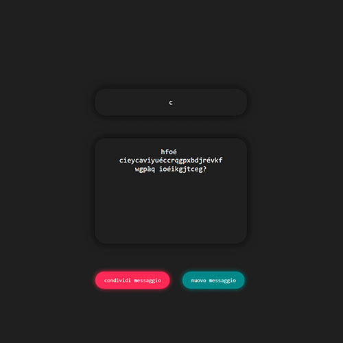

###### *Tool* *Progetto personale*

# Enigma

## Descrizione 📢

Pagina web per criptare e decriptare messaggi attraverso una chiave. Il meccanismo è quello del cifrario di Vigenère, a mio parere uno dei migliori cifrari perché è semplice da applicare ma altrettanto complesso da decifrare, senza utilizzare programmi.
Similmente al cifrario di cesare, questo si basa sulla traslazione delle parole nell'alfabeto, solo con la chiave è possibile riportare ogni lettera "al posto giusto"

*Esempio di un semplice messaggio criptato attraverso la parola "chiave". [Link al messaggio 🔗](https://domescala.github.io/enigma/?jhq%20bekg%C3%B2ecxk%C3%B2w%20eetsirzdflt%20xmhyir%C3%A9sbkq%20kmilvegi?)*

## Cifrario di Cesare 🔒

Partiamo dal cifrario di cesare, che è più semplice. In questo caso i passaggi per criptare una frase sono:

1. Scegliere la frase da codificare
2. Scegliere un numero X da 1 a 21, sarà la chiave di codifica/decodifica
3. Spostare ogni lettere di X posizione nell'alfabeto
4. Trascrivere il messaggio con il nuovo alfabeto
5. Per decodificare, basterà ripetere gli ultimi passaggi all'inverso  

> Se prendiamo ad esempio la chiave "2" ogni lettera dell'alfabeto si sposterà di 2 posti:  
> `A B C D E F G ...`  
> `⬇ ⬇ ⬇ ⬇ ⬇ ⬇ ⬇  `  
> `C D E F G H I...`  

> Esempio di una frase criptata con la chiave "2"  
> `C E R A U N A V O L T A`  
> `⬇ ⬇ ⬇ ⬇ ⬇ ⬇ ⬇ ⬇ ⬇ ⬇ ⬇ ⬇`  
> `E G T C Z P C A P N V C`

Già così la frase codificata a primo impatto è illeggibile. Ma per forzarla basterebbe fare alcune prove e nel peggiore dei casi si troverebbe la soluzione al ventunesimo tentativo, perchè esistono solamente 21 chiavi possibili.

## Cifrario di Vigenère 🔏

Questo un cifrario di cesare potenziato, infatti la chiave non è un singolo numero, ma una serie di numeri: in questo modo le lettere nella frase sono traslate ognuna di un valore differente (o quasi).  

I passaggi sono:

1. Scrivere la frase da criptare
2. Scegliere una parola da utilizzare come chiave
3. Scrivere la chiave ripetuta
4. Criptare la frase:  
   1. ad ogni lettera della chiave, trovare la posizione x di tale lettera nell'alfabeto (partendo da zero)
   2. trasla la lettera della frase di x posizioni

> esempio con la frase precedente, utilizzando come chiave la parola "ALCE". La chiave si deve disporre ripetuta per tutto il messaggio:  
> `C E R A U N A V O L T A`  
> `A L C E A L C E A L C E`  

> Si convecrtono le lettere della chiave nelle posizioni dell'alfabeto (partendo da zero)  
> `A B C D E F G H ...`  
> `0 1 2 3 4 5 6 7 ...`  
> quindi i valori della chiave saranno:   
> `A L C E`  
> `0 9 2 4`

> `C E R A U N A V O L T A`  
> `⬇ ⬇ ⬇ ⬇ ⬇ ⬇ ⬇ ⬇ ⬇ ⬇ ⬇ ⬇`  
> `A L C E A L C E A L C E`   
> `⬇ ⬇ ⬇ ⬇ ⬇ ⬇ ⬇ ⬇ ⬇ ⬇ ⬇ ⬇`  
> `0 9 2 4 0 9 2 4 0 9 2 4`    
> `⬇ ⬇ ⬇ ⬇ ⬇ ⬇ ⬇ ⬇ ⬇ ⬇ ⬇ ⬇`  
> `C P T E U Z C C O U V E`  

> `C + A (+0) = C`  
> `E + L (+9) = P`  
> `R + C (+2) = T`  
> `A + E (+4) = E`  
> `U + A (+0) = U`  
> `N + L (+9) = Z`  
> `A + C (+2) = C`  
> `V + E (+4) = C`  
> `O + A (+0) = O`  
> `L + L (+9) = U`  
> `T + C (+2) = V`  
> `A + E (+4) = E`  

## Funzionamento 🧪

Il meccanismo è esattamente quello del cifrario di Vigenère, ma l'alfabeto utilizzato per traslare le lettere include anche spazi e molte delle lettere accentate. In questo modo i risultati appaiono più "strani" da vedere.

Attraverso un Listener, il testo viene criptato o decriptato in tempo reale, man mano che si digita la chiave lettera per lettera. Questo sia per rendere più veloce e fruibile l'esperienza, ma anche per mostrare proprio il cifrario all'opera.

### Procedimento

Il testo si decripta automaticamente mentre si digita la chiave, quindi occorre seguire il procedimento nel giusto ordine.
Per cifrare un testo:

- Scrivi una chiave
- Scrivi un messaggio
- Cancella la chiave e guarda il messaggio codificarsi poco per volta.
- Condividi il link con il messaggio  

Per decifrare un testo:

- Scrivi il messaggio cifrato
- Inserisci la chiave corretta e guarda il messaggio decodificarsi

  
<a class="markdown-button" href="https://domescala.github.io/enigma/">Vai al cifrario 🔗</a>

