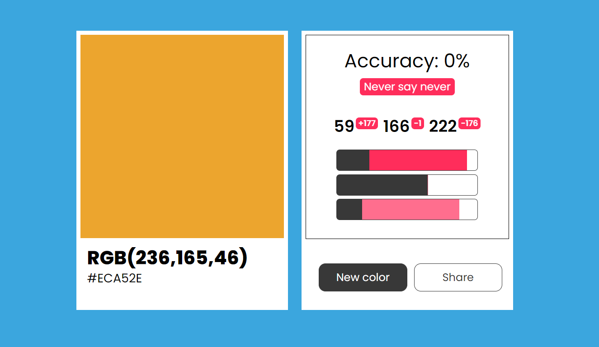

<meta name="description" content="Analisi e sviluppo di 'Guess the RGB': minigame che mette alla prova la vista e la memoria di qualsiasi graphic designer.">
<favicon-emoji>📚</favicon-emoji>

###### *Minigame* *Progetto personale* 
# Guess the RGB
## Descrizione 📢
Mini gioco che mette a dura prova la vista e la memoria di qualsiasi graphic designer. Saresti in grado di trovare il colore giusto, ma senza guardare? Perché **Guess the RGB** non ti mostrerà la classica interfaccia del color picker, ma dovrai inserire manualmente i valori dei tre canali (rosso, verde e blu) senza poter guardare il colore che stai componendo!

*Screenshot di una partita persa: il giocatore doveva trovare il colore giallo, ma ha composto un azzurro. L'accuratezza è completamente nulla nonostante che il valore sul secondo canale (verde) sia azzeccato, questo per via del [calcolo del punteggio 🔗](#punteggio).*
## Gameplay 🎮
- Il gioco genera un colore casuale che compare sullo sfondo ed all'interno della carta
- Il giocatore, usando i tre cursori, imposta una quantità di colore per i singoli canali. Da 0 a 255. E preme su conferma 
- Il gioco rivela il codice del colore generato:
  - Appaiono dei valori che mostrano la differenza di errore, ad apice dei numeri appena inseriti (+30, -20 ecc ...)
  - Sui cursori appaiono due barre, colore rosso e rosso scuro, che mostrano la differenza di errore
- Sullo sfondo il colore diventa in un gradiente diagonale, che parte dal colore corretto a quello inserito dal giocatore 
- Appare una valutazione finale, per congratularsi o in alcuni casi per incoraggiare il giocatore a riprovare 
- È poi possibile condividere il risultato o estrarre un nuovo colore

## Ma che cos'è il codice RGB?? 🤔
In breve, un codice RGB contiene tre valori che rappresentano rispettivamente la quantità di rosso, di verde e di blu di un colore. Ognuno di questi può assumere un valore tra 0 e 255.
> Ad esempio il nero sarà nullo per tutti i canali:  
> `rgb(0, 0, 0)`  
> Mentre il bianco l'esatto opposto:  
> `rgb(255, 255, 255)`  
> Oppure un colore verde-acqua avrà i valori dei canali blu e verde molto più alti rispetto al rosso. Come ad esempio:  
> ` rgb(0,180,160)` 
 

    

        

        

        

    

    

        <i>ROSSO</i>255
        <input type="range" value="255" max="255" oninput="__update_rgb('--rgb-red',this, 0)">
        <i>VERDE</i>255
        <input type="range" value="255" max="255" oninput="__update_rgb('--rgb-green',this, 1)">
        <i>BLUE</i>255
        <input type="range" value="255" max="255" oninput="__update_rgb('--rgb-blue',this, 2)">
    

Spesso si utilizza il codice esadecimale per rappresentarli. Ogni canale è rappresentato da una coppia di cifre da `0` ad `F` (la base esadecimale è così: `0` `1` `2` `3` `4` `5` `6` `7` `8` `9` `A` `B` `C` `D` `E` `F` `10` `11` `12`...)

> Ad esempio il verde-acqua di prima è:  
> `RGB(000,180,160)`  
> `R: 000 -> 00`  
> `G: 180 -> B4`  
> `B: 160 -> A0`  
> Hex: `#00B4A0` 

È importante sapere che, ad eccezione di qualche folle designer, i codici rgb non si compongono "a memoria", ma in tutti i software di grafica è disponibile uno strumento chiamato "RGB Picker" che mostra in tempo reale il colore che si sta creando.  

Per altri dettagli consiglio la lettura di questa [pagina](https://it.wikipedia.org/wiki/RGB).

## Strategie per trovarlo 🎯
La strategia migliore è quella di scomporre il colore che vediamo in tre elementi: saturazione, luminosità e tonalità.
### Tonalità 🎨
Per tonalità si intende proprio quello che comunemente chiamiamo "colore": rosso, blu, giallo, verde, azzurro, arancione, viola ecc ecc. In questo caso bisogna individuare il colore "principale" tralasciando se è scuro o chiaro, se è spento o acceso. Da questo bisogna risalire ai colori che lo compongono: 
> Ad esempio un azzurro (ciano) è composto dalla somma del blu e del verde, in assenza quindi di rosso. Se poi il blu è maggiore del verde si ottiene un vero e proprio azzurro:  
>     

> Per il viola si sommano prima blu e rosso, ottenendo un magenta, poi si diminuisce la quantità di rosso:
>     

> Allo stesso modo il giallo nasce dal rosso e dal verde. Se poi il verde diminuisce il colore finale diventa arancione:
>     
>  

### Luminosità 💡
La luminosità è più immediata da trovare, si tratta di capire se un colore tende più verso il nero o più verso il bianco. Se un colore è tanto luminoso **allora i cursori si troveranno sulla destra** e viceversa.
> Scala della luminosità sul colore rosso  
>  -  

### Saturazione 🌈
Per saturazione si intende invece quanto un colore è... *"colorato🥴"*. Ossia quanto è acceso, brillante.
Per intenderci, un colore possiamo immaginarlo in una scala che va dal grigio a quel colore. Da questa scala si può  notare come il colore diventi sempre più spento e triste, fino a raggiungere il grigio. Amici, quella è la scala della saturazione.  
**Più un colore è saturo e più i valori (e quindi i cursori) saranno distanti fra loro, e viceversa.** 
> Scala della saturazione del rosso:  
>  -----------------------------------------------------------------  

> I "grigi" infatti hanno sempre gli stessi valori, lo avevi notato no?   

## Funzionamento 
### Punteggio 
Il punteggio finale è definito da una percentuale di accuratezza. Minore è l'errore e maggiore sarà il punteggio. Tuttavia, diversamente da come si potrebbe pensare, il calcolo non segue una funzione lineare, ovvero errore e punteggio non vanno di pari passo. Il calcolo è il seguente:  
> Si trovano gli errori, ovvero le differenze tra l'RGB originale e quello inserito dall'utente:  
> $$R_{diff} = |R_{gioco} - R_{utente} |$$
> $$G_{diff} = |G_{gioco} - G_{utente} |$$
> $$B_{diff} = |B_{gioco} - B_{utente} |$$

> Media delle tre differenze:
> $$ Media = (R_{diff} + G_{diff} + B_{diff})/3 $$

> Normalizzazione -> si ottiene un valore da zero a uno
> $$ n = Media / 255 $$  

> Si capovolge la direzione dell'intervallo: ( ` 1` rappresenta l'assenza di errori)
> $$ x = 1 - n $$

> Stima dell'accuratezza:  
> $$ Accuratezza_\% = (x ^ {1 / {x^4} })*100 \% $$ 

La formula dell'accuratezza cerca di fare una stima della differenza dei due colori. L'andamento non è lineare: quando la differenza tra i due colori è del 50% il risultato sarà pressoché zero. Questo perché già una  piccola variazione (anche se è distribuita sui tre canali) modifica drasticamente il colore. Come descritto su wikipedia [la differenza fra due colori](https://en.wikipedia.org/wiki/Color_difference) è un argomento complesso, in cui anche la percezione umana è un fattore importante. La formula che calcola il punteggio di *Guess the RGB* NON è rigorosa, ma è stata creata provando tentativo dopo tentativo.

