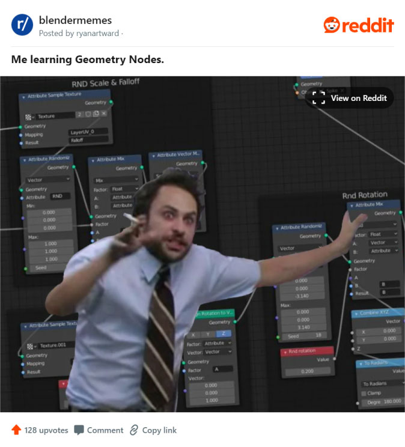
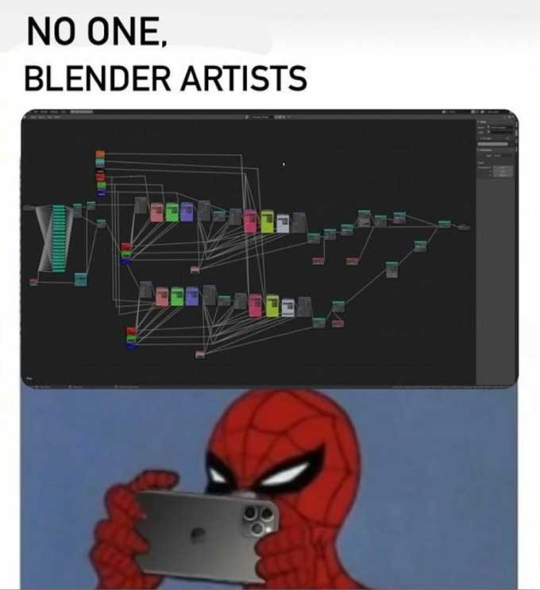
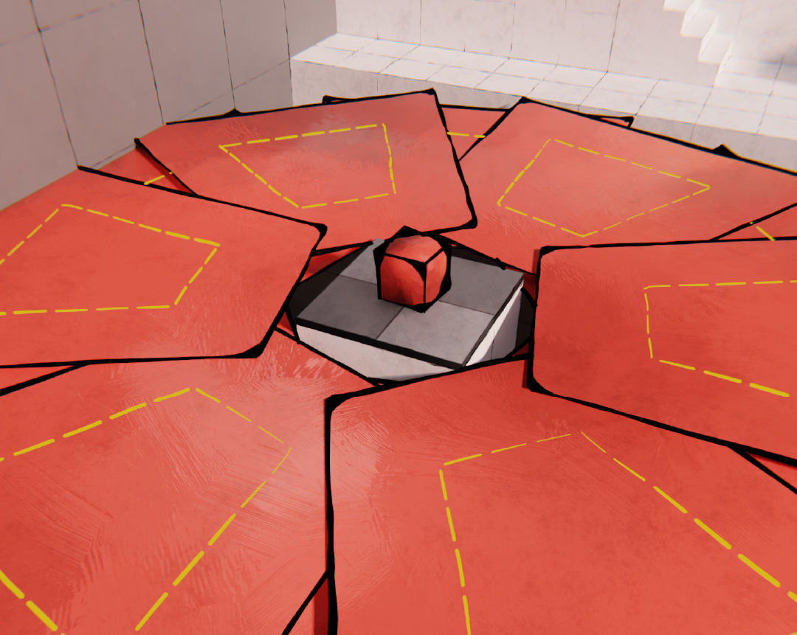
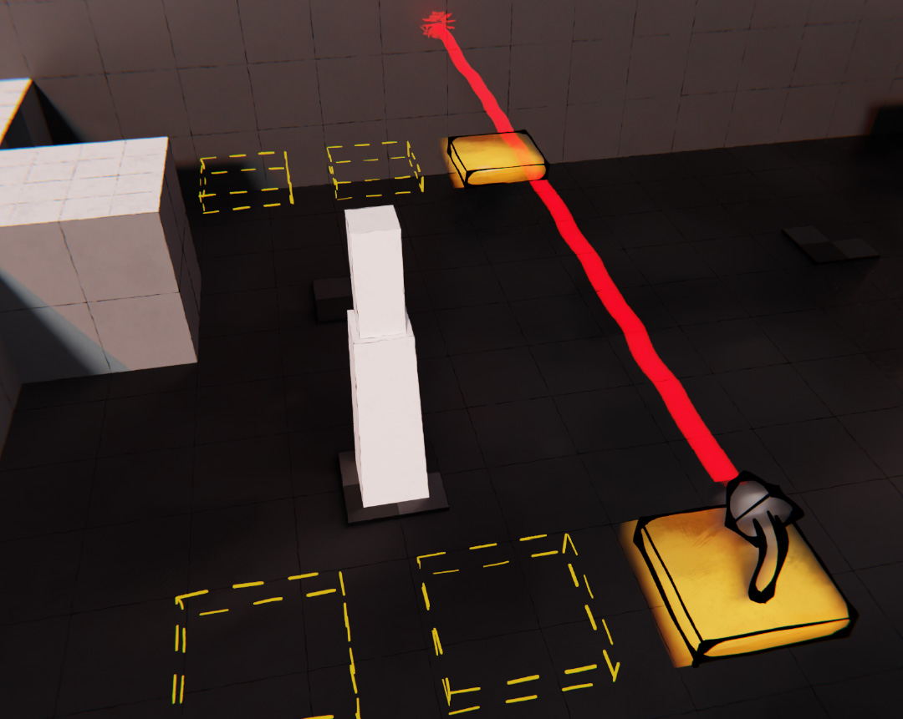
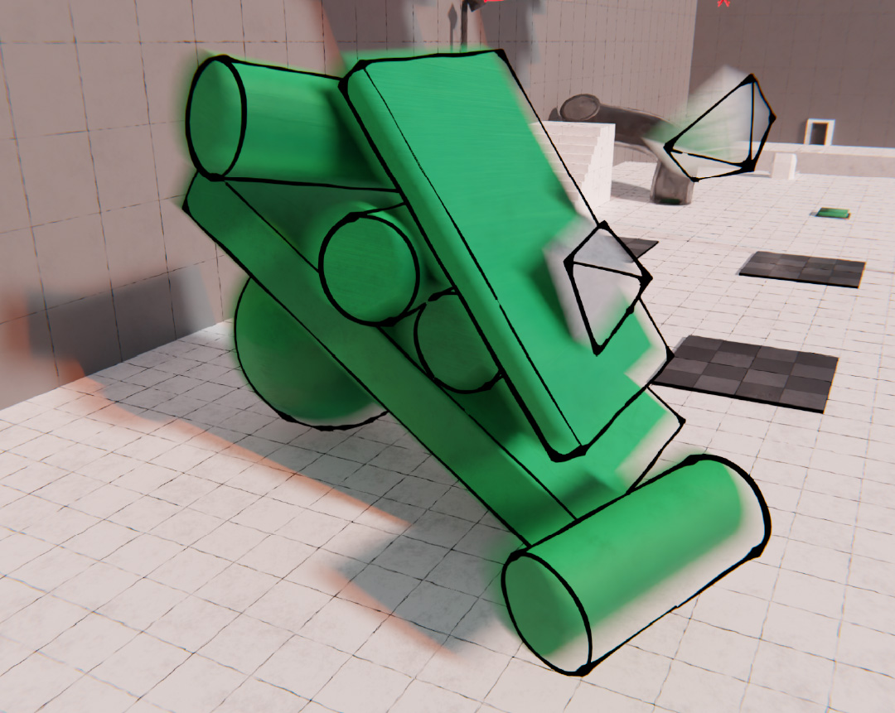
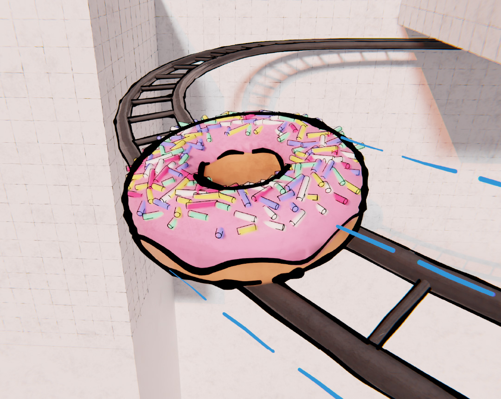

###### *Game Design* *Tesi Universitaria*

<compileMeta 
  description="Presentazione di 'Node Class' un videogioco educativo che mira ad insegnare i Geometry Nodes di Blender, ideato e progettato per la mia Tesi di Laurea"
  image="nodeclass-donut.jpg" 
/>
<favicon-emoji>🎮</favicon-emoji>

# Node Class

## Descrizione 📢

Node Class è un gioco educativo che mira ad insegnare i Geometry Nodes di Blender. Diversamente da altri corsi, Node Class sfrutta la componente di intrattenimento per soffermarsi sui dettagli degli argomenti, fornendo una spiegazione esaustiva e completa.

## Scenario 🗺️

I geometry nodes sono uno strumento estremamente potente nelle mani degli artisti ed offrono nuove opportunità nella realizzazione di modelli complessi. 

Nonostante la familiarità con l’interfaccia a blocchi, già ben nota alla community per via dei nodi dello shader e del compositor, i GN possono risultare complessi per molti utenti che non mostrano una particolare inclinazione verso la matematica e di conseguenza per la programmazione. Pur riuscendo a destreggiarsi con successo, gli utenti sovente non comprendono appieno ciò che fanno.  

Il progetto di Node Class vuole essere una risorsa esaustiva e dettagliata, ma che sia al contempo accessibile e coinvolgente. 

## Concept 🎮

Le componenti di dinamicità e di intrattenimento, collegate a una didattica dettagliata, richiamano gli elementi caratteristici dell'edutainment. La soluzione proposta consiste, pertanto, nello sviluppo di un gioco educativo, in grado di essere dinamico e divertente.  

In seguito ad una accurata ricerca, sono stati definiti il **genere** del gioco, l'**ambientazione**, la **trama**, i **personaggi** e soprattutto un **percorso didattico**.  
Questo percorso è stato sintetizzato in 12 argomenti principali riguardo la modellazione, la geometria e i GN, partendo da nozioni semplici, a volte banali, fino a quelle più complesse e difficili.

## Sviluppo 🎨

Ognuno dei 12 capitoli è stato suddiviso in più sotto argomenti, da trattare in modo approfondito in un livello apposito.
La creazione di un livello partiva quindi dagli obiettivi didattici: si definivano enigmi, oggetti, situazioni, spiegazioni e passaggi al fine di rendere chiaro l'argomento in questione.  

Per *sviluppo* si intende la realizzazione **completa** degli ambienti 3D delle stanze e di tutti gli oggetti in Blender. Utilizzando proprio i Geometry Nodes per rendere accurate e fedeli tutte le trasformazioni (spesso anche in modo interattivo, proprio sfruttando le animazioni con i Geometry Nodes).

*Nei livelli e nella trama, non mancano riferimenti pop ed easter egg, come il famoso Donut di Blender Guru e il Companion Cube di Portal. Lo screenshot riporta il livello in cui si spiega il concetto di istanza e nel quale sono stati utilizzati oggetti molto singolari, diversi da semplici geometrie*

