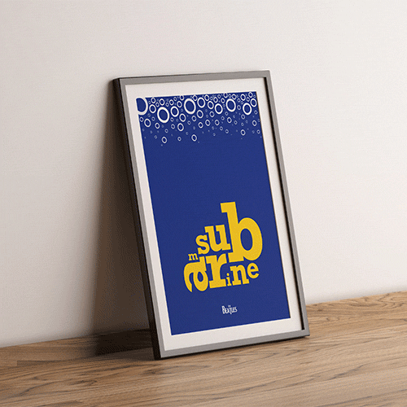
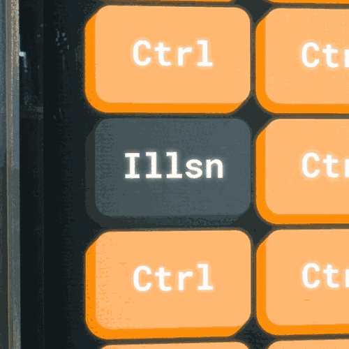

<meta name="description" content="Composizioni ispirate ai Beatles, Inception e Mr. Robot, utilizzando solamente solo caratteri tipografici per una esercitazione universitaria.">
<favicon-emoji>🔠</favicon-emoji>

###### *POSTER \ TIPOGRAFIA* *PROGETTO UNIVERSITARIO*

# Poster tipografici
In questa piccola esercitazione l'obiettivo era formare una composizione per un poster utilizzando solamente caratteri tipografici. 

## Yellow Submarine 🚢

  

Le lettere "submarine" compongono un sottomarino giallo citando il singolo "Yellow Submarine" dei Beatles, mentre una serie di lettere "o" con grandezza, inclinazione e trasparenza variabile creano l’effetto delle bollicine sullo sfondo.

Il carattere utilizzato è il Rockwell, uno slab-serif con delle grazie in grado di ricordare le tubature e le forme del sottomarino.

## Dream is collapsing ⛷&#xFE0F;

Le lettere descrivono visivamente il titolo del brano di Hans Zimmer *Dream is collapsing*, parte della colonna sonora per il film Inception di Christopher Nolan.

Il font usato è il Bebas, il carattere di tipo condensed si sviluppa piu in verticale, dando la possibilità di compattare un lungo testo (come il titolo del brano) in poco spazio. Inoltre il fatto che sia un carattere molto simmetrico crea un forte contrasto con la disposizione frammentata delle lettere in "caduta libera". Proprio questa disposizione disordinata rimane leggibile grazie alla forte semplicità del Bebas.  

## Control is an illusion 👨🏻‍💻

Il poster fa riferimento ad una frase e ad una scena del settimo episodio (*eps2.5_h4ndshake.sme*) in cui avviene un plot twist sconvolgente.
**Questa composizione vuole raccontare proprio questo passaggio narrativo**: i rettangoli colorati sono dei semplici tasti "Ctrl" (control) affiancati ad un solo tasto "Illsn" (illusion). Questi tasti rappresentano proprio i personaggi della scena...

⚠&#xFE0F; Il prossimo paragrafo contiene spoiler riguardo all'episodio e07s2 e di conseguenza sull'intera seconda stagione.  

Il protagonista, Elliot Alderson, si accorge di esser l'unico a non avere sotto controllo la propria vita ed di aver vissuto in una piccola illusione fino a quel momento.   Durante tutta la seconda stagione infatti, Elliot si trova in carcere, ma la sua mente, per sopportare il dolore e per distrarlo, gli fa credere di essere tornato a casa dalla madre per qualche giorno.  I tasti "Ctrl" rappresentano gli altri carcerati che invece sono ben consapevoli della loro condizione e di indossare per l'appunto una tuta "arancione". Il tasto "Illsn" è Elliot, che crede di vestire i suoi soliti panni, per l'appunto "scuri".

