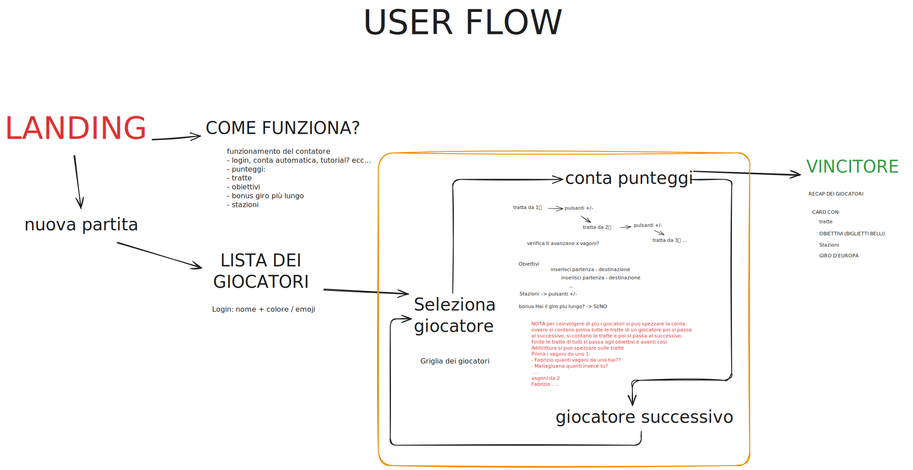
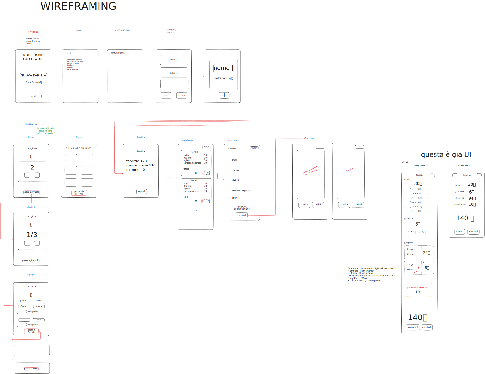
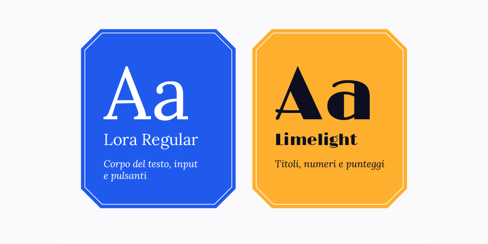
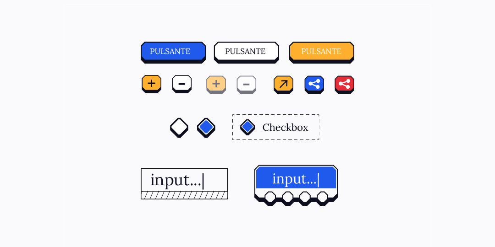
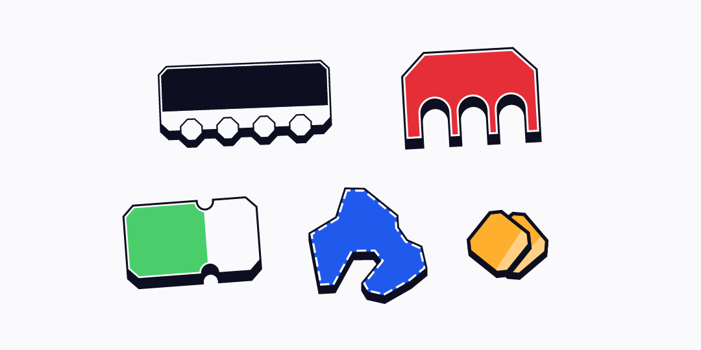
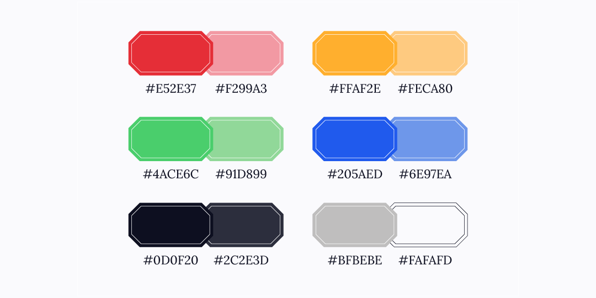
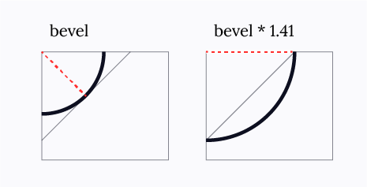
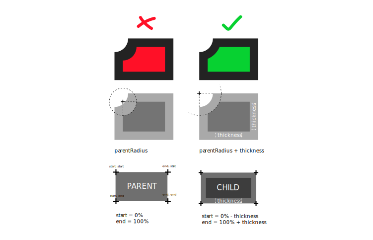

<style>
.__ttrdiv{
width:150px;
height:100px;
background: orange;
margin:5px auto;
display: flex;
justify-content: center;
align-content: center;
}
.__ttr-a{
mask: linear-gradient(135deg, #0000 14px, #000 0%);
}
.__ttr-b{
mask: linear-gradient(-135deg, #0000 14px, #000 0%), linear-gradient(135deg, #0000 14px, #000 0%), linear-gradient(-45deg, #0000 14px, #000 0%), linear-gradient(45deg, #0000 14px, #000 0%); 
mask-composite: intersect;
}
.__ttr-c{
mask: radial-gradient(20px at 0 0,  #0000 100%, #000)
}
.__ttr-d{
mask:radial-gradient(20px at 0 0,#0000 100%,#000),radial-gradient(20px at 0 100%,#0000 100%,#000),radial-gradient(20px at 100% 0,#0000 100%,#000),radial-gradient(20px at 100% 100%,#0000 100%,#000);mask-composite: intersect;
}
.__ttr-e{
background:black;
mask:radial-gradient(20px at 0 0,#0000 100%,#000),radial-gradient(20px at 0 100%,#0000 100%,#000),radial-gradient(20px at 100% 0,#0000 100%,#000),radial-gradient(20px at 100% 100%,#0000 100%,#000);mask-composite: intersect;
}
.__ttr-e-child{
mask:inherit;
mask-composite: inherit;

margin: 15px;
width: calc(100% - 30px);
height: calc(100% - 30px);
}
.__ttr-f {
background: black;
--parent-radius: 20px;
--radius: var(--parent-radius);
/* coordinate per le origini dei cerchi*/
--start: 0%;
--end: 100%;                        
--a: #0000 100%, #000; /* (è sempre uguale) */
mask:
radial-gradient(var(--radius) at var(--start) var(--start), var(--a)),
radial-gradient(var(--radius) at var(--start) var(--end),   var(--a)),
radial-gradient(var(--radius) at var(--end)   var(--start), var(--a)),
radial-gradient(var(--radius) at var(--end)   var(--end),   var(--a));
mask-composite: intersect;
}

.__ttr-f-child {
--thick: 15px;
margin: var(--thick);
width: calc(100% - calc(var(--thick) * 2));
height: calc(100% - calc(var(--thick) * 2));
--radius: calc(var(--parent-radius) + var(--thick));
--start: calc(0% - var(--thick));
--end: calc(100% + var(--thick));
mask:
radial-gradient(var(--radius) at var(--start) var(--start), var(--a)),
radial-gradient(var(--radius) at var(--start) var(--end),   var(--a)),
radial-gradient(var(--radius) at var(--end)   var(--start), var(--a)),
radial-gradient(var(--radius) at var(--end)   var(--end),   var(--a));
mask-composite: intersect;
}
.__ttr-img{
  position:relative;
}
.__ttr-img img{
  position:absolute;
  top:0;
  left:0;
  animation: __ttr-img-blink 10s infinite;
  opacity:0;
}
.__ttr-img img:nth-child(1){
  position: unset;
  animation-delay: 8s;
}
.__ttr-img img:nth-child(2){
  animation-delay: 6s;
}
.__ttr-img img:nth-child(3){
  animation-delay: 4s;
}
.__ttr-img img:nth-child(4){
  animation-delay: 2s;
}
@keyframes __ttr-img-blink{
  0%{opacity:0}
  15%{opacity:0}
  20%{opacity:1}
  35%{opacity:1}
  40%{opacity:0}
  100%{opacity:0}
}
</style>
###### *web* *Progetto personale*

# Unofficial Ticket to Ride Scoreboard

## Descrizione 📢

Questa pagina è una sorta di calcolatrice / segnapunti per il gioco da tavolo Ticket to Ride: Europe, che permette ai giocatori di calcolare il punteggio a fine partita in modo semplice e veloce.   
L'intero progetto è realizzato con il framework  Vuejs 🎉

<p style="display: flex; justify-content: center;">
<video style="max-width:100%;  aspect-ratio: 2; background: #fafafc;" autoplay loop muted><source src="reel.webm" type="video/webm" /></video>
</p>


## Problema 🚩

Il conteggio dei punti in ticket to ride avviene alla fine della partita, quando, nella maggior parte dei casi, si è già esauriti. La conta non è così rapida: richiede diverse operazioni matematiche poco entusiasmanti. In breve si sommano i punteggi di ogni linea moltiplicati per il valore della linea, a questi si sommano, i punti delle stazioni, degli obiettivi e i 10 punti bonus a chi ha composto la tratta più lunga. Inevitabilmente si finisce per utilizzare un foglio A4 e una calcolatrice. 

## Soluzione 🎉

Mentre si conta il numero di tratte potrebbe essere utile avere uno strumento con i pulsanti `➕` `➖` che in automatico restituisce il punteggio. Questo per ogni tratta, per il numero delle stazioni. Restituendo anche i vagoni rimasti in modo da verificare se i conti non tornano (in tutto sono 45)

Per i punteggi dei ticket invece, una possibile soluzione è inserire i nomi delle due città e spuntare la casella se la tratta è stata "completata". 

> Nelle prime versioni di questo progetto, i biglietti erano calcolati attraverso dei pulsanti anonimi che riportavano i punteggi standard dei ticket (5,6,8,9,10,12,15,21). Questa era una delle soluzioni piu immediate: "Ho completato Palermo-Mosca e sono 21 punti -> click su il tasto 21"  
Tuttavia, l'inserimento di questa lista di numeri anonimi diversi tra loro potrebbe diventare problematico in caso di un errore nella digitazione.

Per l'assegnazione del bonus invece sarà compito dei giocatori contare sul tabellone qual'è la linea più lunga e sezionare sull'app il giocatore corrispondente. Questa fase è molto apprezzata dai giocatori e sostituirla con algoritmo porterebbe solamente svantaggi.

## UX 👤

Lo user flow è estremamente semplice. ll giocatore che arriva sulla pagina si soffermerà nel capire il funzionamento (forse) e poi avvierà una partita. Da qui dovrà inserire i nomi dei giocatori per procedere e iniziare la fase di conta. In questo è di fatto un loop in cui si seleziona il giocatore corrente, si setta il punteggio di vagoni o stazioni... e poi si passa al giocatore successivo.infine si passa alla pagina della classifica.



In questa bozza per il wireframing si definiscono in modo grezzo come saranno divise le sezioni e come saranno connesse tra loro. Per rendere la conta più coinvolgente si è pensato di lasciare libero il giocatore di seguire l'ordine che preferisce: ovvero contare prima tutti i punti di uno e passare al successivo oppure contare i punti solo delle linee e poi passare al successivo. (in questo modo non c'è un ultimo giocatore che deve aspettare il suo turno annoiandosi)

Il Bonus è "fuori" dal loop della conta, perché non è necessario che si ripeta per ogni giocatore.



## UI 🕹&#xFE0F;

### STILE 🖌&#xFE0F;
Lo stile di *Ticket to Ride: Europe* si rifà ad una ambientazione ottocentesca, contiene moltissime illustrazioni ricche di dettagli, così come i testi, carichi di ghirigori. Si è definito uno stile che richiami l'ambientazione della rivoluzione industriale, dei treni e dei biglietti, ma mantenendo un aspetto più moderno e colorato. 
### CARATTERI 🈂&#xFE0F;
Per i font si è scelto Lora per il corpo del testo che in qualche modo ricorda i caratteri utilizzati per i biglietti ferroviari e Limelight per i titoli che invece riporta subito ad una ambientazione molto retrò.



### DOM ELEMENTS 🎛&#xFE0F;
Per gli elementi della UI (pulsanti, input, checkbox...) si è preso come riferimento la forma di un rettangolo con i bordi e con gli angoli smussati a 45 gradi perché ricorda vagamente la forma di un biglietto 👉🏻🎟&#xFE0F;. A questi è stato aggiunto un bordo inferiore molto spesso, simulando un'ombreggiatura, questa è utilizzata anche per creare l'effetto del pulsante premuto.  
Per gli input e le card si è utilizzato invece un rettangolo con al fondo un pattern tipo "zigrinatura", mentre l'input del nome dei giocatori altro non è che un vagoncino del colore corrispondente (che si adatta in larghezza al nome)



### ICONE 🖼&#xFE0F;
Per le icone/illustrazioni si è scelto di stilizzare gli elementi principali del gioco: vagone, stazione, biglietto, "europa" e monete (che rappresentano in realtà il concetto di punteggio) utilizzando come per gli elementi UI un rettangolo smussato come forma di partenza, contorni netti, outline e con un bordo inferiore molto spesso.   



### PALETTE 🎨

I colori richiamano quelli dei 5 giocatori: rosso, blu, verde, giallo e nero. A ciascuno di essi è assegnato una variante più chiara. 

Durante la conta varie icone assumono il colore del giocatore corrispondente:

<p class="__ttr-img">


</p>


## Funzionamento 🎮

Inizialmente i giocatori inseriscono i loro nomi nel vagoncino del proprio colore (rosso, blu, verde, giallo, nero) e avviano il tabellone. I giocatori possono cambiare il loro nome in qualsiasi momento. 

### Punteggio 💯

Nella sezione della conta dei vagoni si utilizzano i tasti `-` e `+` per aggiungere le proprie linee: le linee possono essere composte da `1, 2, 3, 4, 6, 8 `vagoni. Rispettivamente il punteggio per ciascuna linea è `1, 2, 4, 7, 15, 21`. (Le linee sul tabellone non sono infinite, ovvero esiste un massimo di linee da 1, da 2, da 3 ecc... ed il contatore impedisce al giocatore in uscire dal range)

Allo stesso modo i giocatori impostano la quantità di Stazioni utilizzate durante la partita `da 0 a 3 stazioni`. Ogni Stazione NON utilizzata vale 4 punti.

Per i biglietti, mentre si controlla su tabellone che non ci siano stati errori, il giocatore inserisce il nome delle due stazioni e spunta la casella "completato". (Gli input sono progettati in modo che inserendo ad esempio "Palermo", le possibili città connesse appariranno come suggerimento nel secondo input, inoltre come per le linee, se un biglietto è stato già registrato da un giocatore non sarà più disponibile per gli altri)

Per l'assegnazione del bonus (+10 punti) i giocatori devono semplicemente premere sul pulsante del giocatore con la tratta più lunga. In caso di parità è presente un checkbox che permette di assegnare a più giocatori il bonus. 

### Classifica 🥇

Infine i giocatori possono accedere alla classifica che viene automaticamente compilata durante il conteggio dei vagoni, stazioni... Dalla classifica è possibile accedere ad un recap dei punteggi divisi in Linee, Stazioni, Ticket e Bonus a loro volta queste sezioni si possono espandere, mostrando nel dettaglio ad esempio quante linee, quali biglietti ecc...

<video autoplay muted loop><source src="ranking.mp4" type="video/mp4"></video>

## Sviluppo 🧪

L'app è stata sviluppata in vue, adottando diverse strategie per la creazione della ui, come i pulsanti smussati <a __relative_path href="#__ttr-result" target="_self">(vai al risultato finale)</a>, le illustrazioni con i colori flessibili...


### Angoli smussati - TENTATIVO CON CLIP-PATH✂&#xFE0F;

In css non è possibile avere gli angoli di un elemento smussati a 45 gradi in modo "naturale", come avviene con la proprietà border-radius, tanto meno avere un angolo con la curvatura al contrario (proprio come quella dei biglietti). Si può fare ricorso ad alcuni trucchetti come utilizzare `clip-path`. Definendo infatti una serie di punti è possibile tagliare via gli angoli di un elemento, il primo problema di questa soluzione è la complessità nel creare una formula che calcoli correttamente i punti. Il secondo problema è che un eventuale bordo verrebbe tagliato via negli angoli:
``` css
clip-path: polygon(25% 0%, 75% 0%, 100% 25%, 100% 75%, 75% 100%, 25% 100%, 0% 75%, 0% 25%)
```
> <span style="display:flex"><span style="border:5px solid #111; margin:15px auto;background:#b9a2ff;; color:black; width:fit-content; padding:30px 10px; border-radius:25px">BORDER RADIUS</span>
<span style="border:5px solid #111; margin:15px auto;background:#b9a2ff;; color:black; width:fit-content; padding:30px 10px; clip-path: polygon(25% 0%, 75% 0%, 100% 25%, 100% 75%, 75% 100%, 25% 100%, 0% 75%, 0% 25%);">CLIP PATH</span></span>

L'unica soluzione è quella di annidare piu elementi assegnando a ciascuno dei colori alternati, dando l'illusione di un bordo

> <span style="display:flex"></span></span><span style="margin:0 auto;background: #111;width:100px;height: 100px;clip-path: polygon(15% 0%, 85% 0%, 100% 15%, 100% 85%, 85% 100%, 15% 100%, 0% 85%, 0% 15%);display:flex;justify-content: center;"><span style="all:inherit; margin:auto;width: 94%;height: 94%;background: #b9a2ff;"></span></span></span>  

<iframe src="bevel-button.html" style="height:100px;"></iframe>

Da questa pagina si puo vedere come sia possibile applicare questo 'bordo smussato' utilizzando clip-path e svariate formule complesse <a __relative_path href="bevel-button.html">bevel-border🔗</a>
Sebbene questa sia una soluzione valida risulta davvero tanto complessa da capire e da gestire.
### Angoli smussati - TENTATIVO CON MASK 🎭
Una soluzione più efficace è infatti quella di utilizzare delle maschere. Posizionando infatti 4 "triangoli" ai bordi dell'oggetto si possono "tagliare" via gli angoli in modo decisamente più intuitivo, la grandezza dello smusso è la grandezza stessa del triangolo. Inoltre se invece di triangoli si usassero dei cerchi il risultato sarebbe una sorta di border-radius invertito 🎉, impossibile da realizzare con clip-path. In questo modo volendo si può creare una combinazione di bordi flat e curvi.

Questi "triangoli" sono in realta dei gradienti lineari

``` css
mask: linear-gradient(135deg, #0000 25px, #000 0%);
background: orange;
```  

> <span class="__ttrdiv __ttr-a"></span>  

Aggiungiamo piu gradienti in modo da coprire tutti gli angoli e utiliziamo `mask-composite: intersect` (altrimenti i gradienti sovrapposti si annullano)  

``` css  
mask: linear-gradient(-135deg, #0000 25px, #000 0%),
      linear-gradient( 135deg, #0000 25px, #000 0%),
      linear-gradient( -45deg, #0000 25px, #000 0%),
      linear-gradient(  45deg, #0000 25px, #000 0%);
mask-composite: intersect;
```
> <span class="__ttrdiv __ttr-b"></span>

in modo simile possiamo ottenere un angolo arrotondato invertito (scoop)

``` css
mask: radial-gradient(35px at 0 0,  #0000 100%, #000);
```
> <span class="__ttrdiv __ttr-c"></span>

utilizzando 4 gradienti possiamo raggiungere tutti e 4 gli angoli. In questo caso utilizziamo le coordinate 
`at 0 0`, `at 0 100`, `at 100 0`, `at 100 100`.

``` css
mask:
 radial-gradient(35px at 0 0, #0000 100%, #000),
 radial-gradient(35px at 0 100%, #0000 100%, #000),
 radial-gradient(35px at 100% 0, #0000 100%, #000),
 radial-gradient(35px at 100% 100%, #0000 100%, #000);
mask-composite: intersect;
```
> <span class="__ttrdiv __ttr-d"></span>

> Tra lo smusso piatto e quello curvo cambia la grandezza del raggio:


Annidiamo due oggetti:
> <span class="__ttrdiv __ttr-e"><span class="__ttrdiv __ttr-e-child"></span></div>
``` css
.parent{
  background:black;
  mask:
  radial-gradient(20px at 0 0,#0000 100%,#000),
  radial-gradient(20px at 0 100%,#0000 100%,#000),
  radial-gradient(20px at 100% 0,#0000 100%,#000),
  radial-gradient(20px at 100% 100%,#0000 100%,#000);
  mask-composite: intersect;
}
.child{
  mask:inherit;
  mask-composite: inherit;
  /* simulazione del bordo */
  --thick: 15px;
  margin: var(--thick);
  width: calc(100% - calc(var(--thick) * 2));
  height: calc(100% - calc(var(--thick) * 2));
}
```

Come si puo notare se il `child` eredita la maschera così com'è lo smusso appare decentrato. Questo perché l'origine dello smusso fa riferimento all'angolo del `child` anzichè del `parent` e perché il raggio utilizzato è lo stesso.  
A rigor di logica i cerchi devono essere sempre concentrici, posizionati negli angoli del `parent`, e il loro raggio deve aumentare con lo spessore del "bordo"  

``` javascript
radius = parent-radius + thickness  
coord_start =   0 - thickness  
coord_end   = 100 + thickness  
```

  

``` css
.parent {
 background: black;
 --parent-radius: 20px;
 --radius: var(--parent-radius);
 /* coordinate per le origini dei cerchi */
 --start: 0%;
 --end: 100%;                        
 --a: #0000 100%, #000; /* (è sempre uguale) */
 mask:
  radial-gradient(var(--radius) at var(--start) var(--start), var(--a)),
  radial-gradient(var(--radius) at var(--start) var(--end),   var(--a)),
  radial-gradient(var(--radius) at var(--end)   var(--start), var(--a)),
  radial-gradient(var(--radius) at var(--end)   var(--end),   var(--a));
 mask-composite: intersect;
}

.child {
 /* spessore del "bordo" */
 --thick: 15px;
 /* simulazione del bordo con margin */
 margin: var(--thick);
 /* dimensionamento */
 width: calc(100% - calc(var(--thick) * 2));
 height: calc(100% - calc(var(--thick) * 2));
 /* il raggio si somma al raggio precendete */
 --radius: calc(var(--parent-radius) + var(--thick));
 /* l'origine dei cerchi è negli angoli del parent! */
 --start: calc(0% - var(--thick));
 --end: calc(100% + var(--thick));
 mask:
  radial-gradient(var(--radius) at var(--start) var(--start), var(--a)),
  radial-gradient(var(--radius) at var(--start) var(--end),   var(--a)),
  radial-gradient(var(--radius) at var(--end)   var(--start), var(--a)),
  radial-gradient(var(--radius) at var(--end)   var(--end),   var(--a));
 mask-composite: intersect;
}
```

Aggiungiamo un effetto di anti-aliasing per rimuovere la fastidiosa scalettatura sui bordi, sarà sufficente sfumare di un pixel il bordo. Anzichè `100%` avremo `100% - 1px`

``` css
.anti-aliasing {
  --a: #0000 calc(100% - 1px), #000;
}
```

Ed ecco il risultato:
<iframe id="__ttr-result" src="bevel-scoop-parametric.html" style="height:500px;"></iframe>

