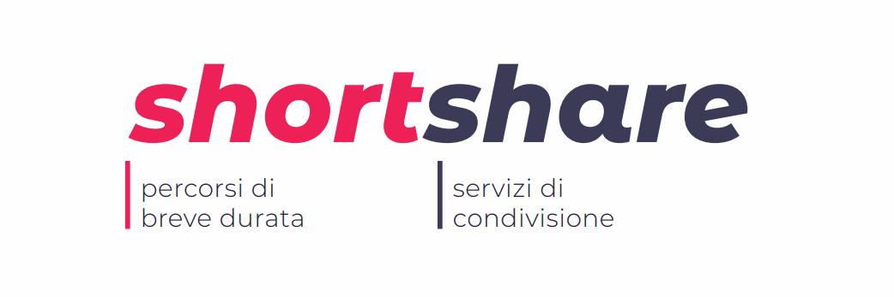
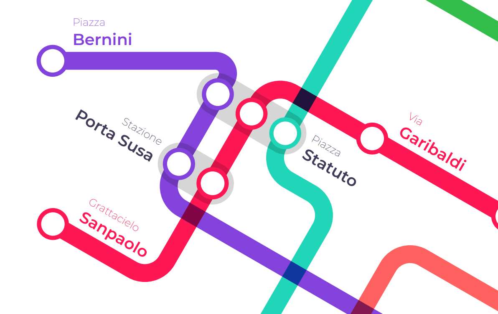
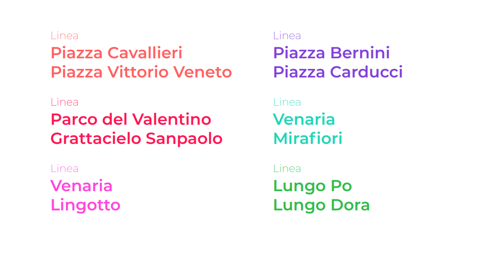
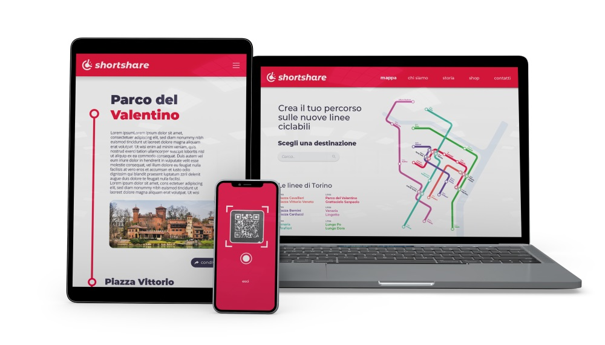
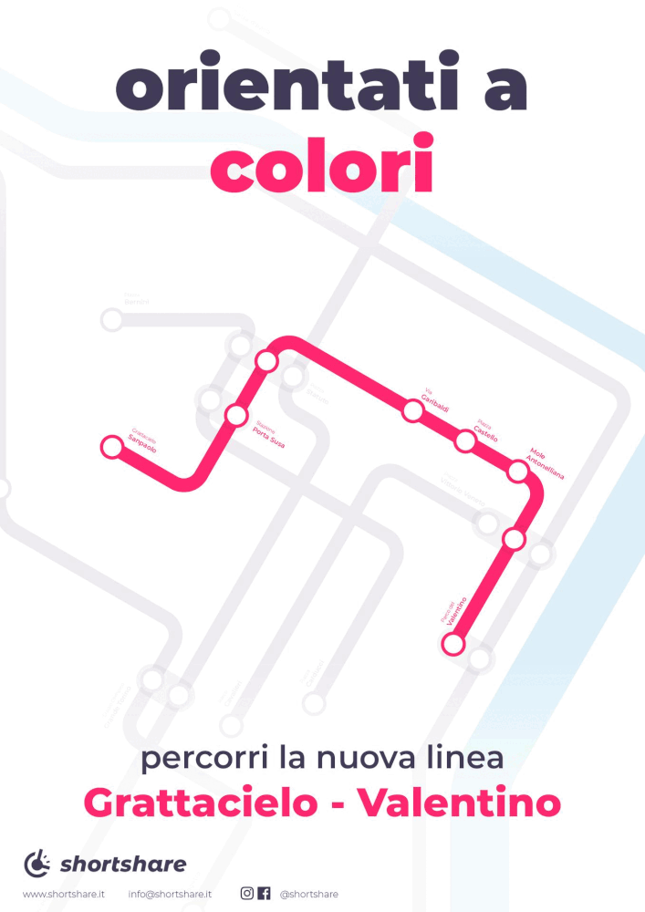

<compileMeta 
  description="Progetto universitario di branding per ShortShare: un'agenzia che promuove lo sharing a bassa percorrenza, attraverso campagne di comunicazioni sul territorio torinese."
  image="mappa_particolare.png" 
/>
<favicon-emoji>🚴🏻‍♀️</favicon-emoji>

###### *CAMPAGNA DI COMUNICAZIONE \ BRANDING* *PROGETTO UNIVERSITARIO*

# ShortShare
## Descrizione 📢
In questa esercitazione è stato creato il brand Shortshare, ovvero un'agenzia che promuove lo sharing a bassa percorrenza, attraverso campagne di comunicazioni sul territorio torinese.

## Contesto 🗺️
Per micromobilità si intendono tutti gli spostamenti brevi si effettuano nel quotidiano all'interno della propria città. Si stima infatti che i percorsi inferiori ai 10 km rappresentano circa il 60% degli spostamenti quotidiani. 

Mentre le città sono alle prese con l'aumento dell'inquinamento e della congestione, una micro mobilità sostenibile può essere una soluzione più pulita ed efficiente per gli spostamenti quotidiani

## Identità 🎨
Il nome, semplice da memorizzare, è la combinazione di short e share, che rappresentano in modo chiaro il concetto di sharing a bassa percorrenza.  
  
Il logo evidenzia con un orologio la rapidità dei percorsi, unito al simbolo di una ruota che richiama al contempo i due mezzi principali: la bicicletta e il monopattino elettrico.
 

## Campagna di comunicazione 🚲
 
È stata pensata una campagna del tipo guerrilla, che includesse tutti i percorsi ciclabili esistenti. 
Sono state individuate i principali luoghi di interesse e sono state definite delle linee ciclabili, sullo stile delle linee metropolitane. Ognuna di un colore differente.

 

La campagna fa leva su un aspetto spesso poco curato nei servizi sharing: l’orientamento. Shortshare propone la creazione di 6 nuove linee ciclabili sulle piste già esistenti a Torino. Queste nuove linee ciclabili danno un’importanza notevole alla micromobilità di Torino integrandola maggiormente nel contesto urbano, al pari delle altre linee urbane. 

 

Questa campagna, simile ad una guerrilla, prevedeva di colorare fisicamente parte delle ciclabili e di distribuire la mappa delle linee, progettata con uno stile volutamente sulla falsariga delle mappe delle metropolitane.

*Sequenza dei poster progressivi durante la campagna. La mappa si evolve aggiungendo una linea alla volta*
